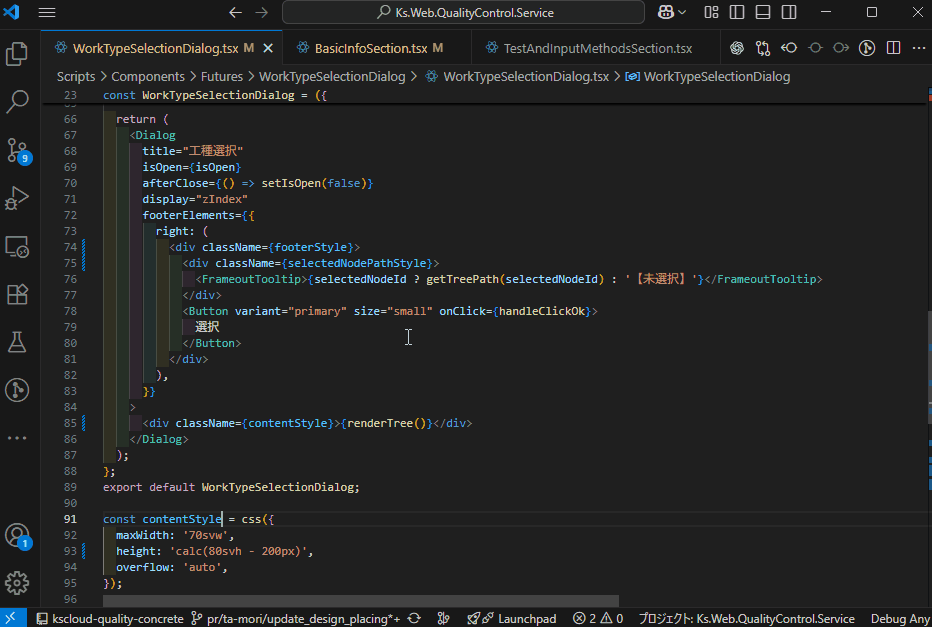

# KETNAME - AI Naming Assistant for VSCode

## 概要

KETNAMEは、日本語のコメントや仕様メモから、プロジェクトの文脈に合った変数名やメソッド名をAIが提案してくれるVSCode拡張機能です。開発者が命名に費やす時間を削減し、思考の中断を防ぎます。

## 主な機能

- **AIによる命名提案**: 作成したい変数や関数の目的を日本語で入力するだけで、AIが複数の命名候補を提案します。
- **文脈理解**: コードの選択範囲やファイル全体をコンテキストとしてAIに渡し、文脈に沿った適切な名前を生成します。
- **プレースホルダーによる置換**: `KV` (変数) や `KM` (メソッド) といったプレースホルダーをコードに記述しておけば、提案された名前を選択するだけで一括置換が可能です。
- **ドメイン知識の反映**: プロジェクト固有の用語集やコーディング規約をまとめたファイルを指定することで、提案の精度をさらに向上させることができます。
- **セキュアなAPIキー管理**: Gemini APIキーはVSCodeのSecretStorageに安全に保管され、設定ファイルに平文で保存されることはありません。

## デモ

## 必須要件

- **LLMプロバイダーのAPIキー**: 本拡張機能は、Azure API Management (APIM) 経由、または直接 Google Gemini API を利用します。利用するプロバイダーに応じたAPIキーが必要です。

## セットアップ

### 1. プロバイダーの選択

1. VSCodeの **設定** を開きます (`File > Preferences > Settings` または `Ctrl/Cmd + ,`)。
2. 検索バーに `ketname.provider` と入力します。
3. 使用するLLMプロバイダーを `apim` (Azure APIM経由) または `gemini` (Google Gemini) から選択します。デフォルトは `apim` です。

### 2. APIキーの設定

選択したプロバイダーに応じて、対応するコマンドを実行してAPIキーを設定します。

- **APIMの場合**: 
  - コマンドパレット (`Ctrl/Cmd+Shift+P`) から `KETNAME: APIMキーを設定` を実行し、お使いのAPIMサブスクリプションキーを入力します。
- **Geminiの場合**:
  - コマンドパレットから `KETNAME: (旧)Gemini APIキーを設定` を実行し、お使いのGemini APIキーを入力します。

APIキーはVSCodeのSecretStorageに安全に保管され、設定ファイルに平文で保存されることはありません。

### 3. (APIMのみ) APIM固有設定

APIMプロバイダーを選択した場合は、必要に応じて以下の設定を行ってください。

1. VSCodeの **設定** を開きます。
2. 検索バーに `ketname.apim` と入力します。
3. 以下の項目を設定します:
   - `ketname.apim.maxTokens`: モデルが生成する最大トークン数。
   - `ketname.apim.temperature`: 生成されるテキストの多様性。

## 使用方法
※イメージは上記デモをご覧ください

1.  **プレースホルダーを配置**:
    - 新しい変数名を考えたい場所に `KV` と入力します。
    - 新しいメソッド（関数）名を考えたい場所に `KM` と入力します。

2.  **コンテキストとして与える範囲を選択**:
    - プレースホルダー（KVまたはKM）を含む、変数が登場する範囲をドラッグします
        - 何も選択しない場合は、ファイル全体がコンテキストに含められます
        - 巨大ファイルを与えるとサジェスト精度が低下する可能性があり、またトークンを多く消費します

3.  **命名を依頼**:
    - ショートカットキー `Ctrl+Alt+N` (Mac: `Cmd+Alt+N`) を押すか、コマンドパレットから `KETNAME: 命名を提案` を実行します。

4.  **意図を入力**:
    - 「ユーザー情報を格納する変数」「合計金額を計算する関数」のように、作成したいものの目的を日本語で入力し、Enterキーを押します。

5.  **候補を選択**:
    - AIから提案された命名候補が一覧で表示されます。候補には、選定理由とAIの自信度も表示されます。
    - 最適なものを選択すると、コード内のプレースホルダー (`KV` または `KM`) が選択した名前に自動で置換されます。

### (オプション) ドメイン知識の活用

プロジェクト固有の用語集やルールをAIに学習させることで、より文脈に沿った命名が可能になります。

1.  VSCodeの **設定** を開きます (`File > Preferences > Settings` または `Ctrl/Cmd + ,`)。
2.  検索バーに `ketname.domainKnowledgePaths` と入力します。
3.  `ドメイン知識・参考資料ファイルパス` という設定項目が表示されます。
4.  `項目の追加` ボタンをクリックし、ドメイン知識が記述されたファイルのパスを入力します。
    - パスはワークスペースからの相対パス、または絶対パスで指定できます。
    - 複数のファイルを設定することも可能です。

## コマンド一覧

| コマンド | タイトル | 説明 |
| :--- | :--- | :--- |
| `ketname.suggestName` | KETNAME: 命名を提案 | AIに命名候補を問い合わせ、選択した名前でプレースホルダーを置換します。 |
| `ketname.setApimKey` | KETNAME: APIMキーを設定 | Azure APIMのサブスクリプションキーを設定・更新します。 |
| `ketname.removeApimKey` | KETNAME: APIMキーを削除 | 設定されているAzure APIMのサブスクリプションキーを削除します。 |
| `ketname.setGeminiApiKey` | KETNAME: (旧)Gemini APIキーを設定 | (旧プロバイダ用) Gemini APIキーを設定・更新します。 |
| `ketname.removeGeminiApiKey` | KETNAME: (旧)Gemini APIキーを削除 | (旧プロバイダ用) 設定されているGemini APIキーを削除します。 |

## 設定項目

| 設定項目 | 説明 | デフォルト値 |
| :--- | :--- | :--- |
| `ketname.provider` | 命名提案に使用するLLMプロバイダー。`apim` または `gemini`。 | `apim` |
| `ketname.apim.maxTokens` | APIMモデルの最大生成トークン数。 | `512` |
| `ketname.apim.temperature` | APIMモデルの生成温度。 | `0.2` |
| `ketname.domainKnowledgePaths` | 命名提案の際にAIが参考にする「ドメイン知識」が記述されたファイルのパス。相対パス・絶対パスの両方に対応。 | `[]` |

## ライセンス

[MIT](./LICENSE)
